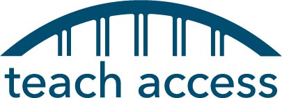
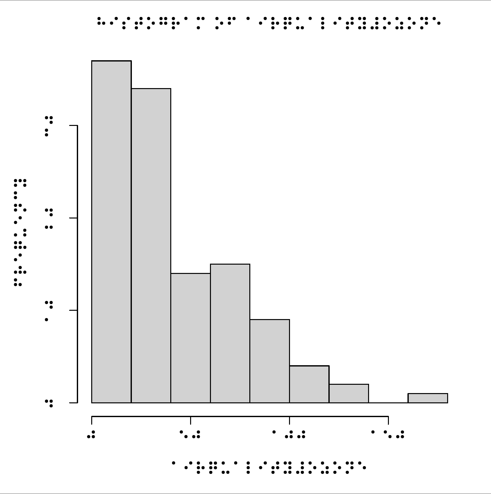

class: title-slide, middle

```{r setup, include=FALSE}
knitr::opts_chunk$set(echo=FALSE, warning=FALSE, message=FALSE)

library(tidyverse)
library(palmerpenguins)

xaringanExtra::use_slide_tone()
theme_set(theme_gray(base_size = 14))

```


# `r rmarkdown::metadata$title`
## `r rmarkdown::metadata$author`
### `r rmarkdown::metadata$subtitle`
### `r rmarkdown::metadata$date`


---
layout:true
<div class="footer"><span>mdogucu.github.io/user2022</span></div>
---

class: middle

## Teaching Context

- Have been teaching at University of California Irvine since July 2019.
- Taught undergraduate and graduate courses on statistics, computing, and data science.
- Teach (with) R mostly.

---

class: middle

![:col_header 
  <span class="framed">Teaching Accessibly </span>,
  <span class="framed">Teaching Accessibility</span>,
  <span style="font-size:45px; color:whitesmoke; border-style: solid; display: inline-block;">Recommendations for the Community</span>
              ]


---

class: middle inverse

Teaching Accessibly


---


class: middle 

.pull-left[
.center[

 


Alicia Johnson          
.font-20[Macalester College]

[<i class="fa-solid fa-house" title="Home Icon"></i>](https://ajohns24.github.io/portfolio)
[<i class="fa-brands fa-github" title="GitHub Icon"></i>](https://github.com/ajohns2)  


]
]

.pull-right[
.center[


Miles Ott  
.font-20[Twitter]

[<i class="fa-brands fa-twitter" title="Twitter Icon"></i>](https://twitter.com/Miles_Ott)
[<i class="fa-brands fa-github" title="GitHub Icon"></i>](https://github.com/MilesOtt)


]
]


---

class: middle 

.font50[Goal: Write a Book on Bayesian Statistics that is Accessible and Inclusive]

---

class:center

```{r echo=FALSE, fig.align='center', out.width="25%", fig.alt="a hex shaped logo with shiny green-pink disco ball and purple starry background. There is text that says Bayes Rules!"}
knitr::include_graphics("img/bayes-rules-hex.png")
```


.pull-left[
<script src="https://use.fontawesome.com/releases/v5.15.1/js/all.js" data-auto-replace-svg="nest"></script>

<i class="fas fa-book fa-2x" aria-hidden="true" title="Book icon"></i>

[Bayes Rules! An Introduction to Applied Bayesian Modeling](https://bayesrulesbook.com)

]

.pull-right[

<i class="fab fa-r-project fa-2x" aria-hidden="true" title="R logo"></i>

[{bayesrules}](https://www.github.com/bayes-rules/bayesrules)
]


---


class: middle 

## Open-Access

- Cost of books and supplies for a student at a four-year university in 2021 was estimated to be $1240 per year ([Hanson, 2021](https://educationdata.org/average-cost-of-college-textbooks)). 


- About 11% of the students indicated that they skipped meals in order to afford books and course materials ([Hanson, 2021](https://educationdata.org/average-cost-of-college-textbooks)).

- The bayesrulesbook.com page has been accessed from more than 150 countries.

---

class: middle

## Assistive Technology

Assistive Technology is any form of technology (software, device) that helps people with disabilities perform certain activities. 

Examples:

- walking sticks
- wheel chairs
- screen readers

---

class: middle

## Screen reader


A screen reader is an assistive technology that supports blind or visually impaired people in using their computer. 


---

class: middle center


<iframe width="560" height="315" src="https://www.youtube.com/embed/l-G4kKTuDHI" title="YouTube video player" frameborder="0" allow="accelerometer; autoplay; clipboard-write; encrypted-media; gyroscope; picture-in-picture" allowfullscreen></iframe>

The video shows use of a screen reader briefly. 
---

class: middle

## Alternate Text

- "Alt text" describes contents of an image. 
- It is used in HTML pages. 
- Screen-readers cannot read images but can read alt text. 
- Alt text has to be provided. 


---

class: middle

In (northern) Summer 2020, we had lots of images but no way to provide alternate text within HTML so we asked for alternate text feature.

```{r fig.alt="GitHub issue created on RStudio's RMarkdown repo asking for fig.alt option to be created", fig.align='center', out.width="100%"}
knitr::include_graphics("img/alttext-github-issue.png")
```

---

class: middle


## Making math accessible

- Calculus is not a prerequisite.
- Checking intuition with quizzes.
- Supporting mathematical concepts with computing.

---

class: middle

## Making learning fun 


> How can we live if we don’t change? 
—Beyoncé. Lyric from “Satellites.”

.center[vs.]

> What is probability?

---

class: middle

## Embracing mistakes as part of learning

> As you read the book and put Bayesian methodology into practice, you will make mistakes. Many mistakes. Making and learning from mistakes is simply part of learning. We hope that you persist through the struggle of learning so that you can contribute your unique insights, perspectives, and experiences to the Bayesian community.

.center[v.s.]

> The proof is obvious.

---

class: middle

# Making learning relevant with diverse set of applications

- Weather
- LGBTQ+ anti-discrimination laws
- Spotify data
- Hotel bookings
- Penguins

---

class: middle

[Dogucu, M., Johnson, A. A., & Ott, M. (2021). Framework for Accessible and Inclusive Teaching Materials for Statistics and Data Science Courses. arXiv preprint arXiv:2110.06355.](https://arxiv.org/abs/2110.06355)

---

class: middle inverse

Teaching Accessibility 

---

class: center


```{r echo=FALSE, fig.alt="A timeline titled brief history of knitr. That points out that the initial commit was in October 2011, first download from CRAN was in October 2012, alt-text feature was requested in July 2020, feature was made available in January 2021", fig.align='center'}

library(tidyverse)

date <- lubridate::as_date(c("2011-10-18", 
                             "2012-10-01",
                             "2020-07-19",
                             "2021-01-22"))

event <- c("initial commit", "first download from CRAN",
           "alt-text feature requested",
           "feature available")

xend <- lubridate::as_date(c("2010-09-01", "2022-12-31"))

timeline <- data.frame(date = date, event=event)

timeline %>% 
  ggplot(aes(x = date)) +
  geom_segment(data = timeline, aes(y = 0, yend = c(5, -5, 5, -5), 
                                    x = date, xend = date)) +
  theme_classic() +
  geom_hline(yintercept=0, 
                color = "black", size = 0.3) +
  ylim(-7,7) +
  xlim(xend[1], xend[2]) +
  theme(axis.line.y = element_blank(),
        axis.text.y = element_blank(),
        axis.title.x = element_blank(),
        axis.title.y = element_blank(),
        axis.ticks.y = element_blank(),
        axis.text.x = element_blank(),
        axis.ticks.x = element_blank(),
        axis.line.x = element_blank()) +
  geom_text(data = timeline, x = date, y = c(-1, 1, -1, 1),
            label = c("Oct 2011", "Oct 2012", "July 2020","Jan 2021"), 
            angle = 90, size = 5) +
  geom_text(data = timeline, x = date, y = c(5.5, -5.5, 5.5, -5.5),
            label = event,
            size=6) +
  geom_point(aes(y = c(5, -5, 5, -5)), size=3) + 
  labs(title = "A brief timeline of knitr") +
  theme(plot.title = element_text(size = 20))

```

```{r echo=FALSE}
logs <- cranlogs::cran_downloads(package = "knitr", 
                         from = "2012-10-01", 
                         to = "2020-07-19")

```

--

Between first CRAN download and alt-text feature request, there were `r prettyNum(sum(logs$count), big.mark = ",", scientific = FALSE)` CRAN downloads of knitr.


---


class: middle

![:col_header 
  ,
  <span class="framed">Developers Create  Tools with no Accessibility Support</span>,
  <span class="framed">Data Scientists Create Inacessible Products</span>
              ]


---

class: middle

![:col_header 
  <span class="framed">Curriculum Does Not Teach Accessibility </span>,
  <span class="framed">Developers Create  Tools with no Accessibility Support</span>,
  <span class="framed">Data Scientists Create Inacessible Products</span>
              ]

---


class: middle

## Acknowledgement

I was supported by the [Teach Access](https://teachaccess.org/) network.


```{r echo=FALSE, fig.align='center', out.width="40%", fig.alt="Teach Access logo that is an illustration of a bridge"}

```
---

class: middle

.center[


JooYoung Seo  
.font-20[University of Illonois Urbana-Champaign]

[<i class="fa-solid fa-house" title="Home Icon"></i>](https://jooyoungseo.github.io/)
[<i class="fa-brands fa-github" title="GitHub Icon"></i>](https://github.com/jooyoungseo)
[<i class="fa-brands fa-twitter" title="Twitter Icon"></i>](https://twitter.com/seo_jooyoung)
]

---
class: middle

[Computing Competencies for Undergraduate Data Science Curricula](https://dstf.acm.org/DSReportDraft2Full.pdf) by Association for Computing Machinery (ACM) Data Science Task Force


Analysis and Presentation, Foundational considerations, Knowledge


**"Accessibility considerations for different groupings of users including those with special needs"**


---


class: middle

## Accessibility as Career Preparation

[Accessible Technology Skills Gap Report  by The Partnership on Employment & Accessible Technology (PEAT), 2018](https://www.peatworks.org/infographic-the-accessible-technology-skills-gap/)

84% of industry respondents say it is important or very important to their company to hire developers and designers with accessible technology skills.


60% said it was difficult or very difficult for their organization to find job candidates with accessibility skills. 0% said it was easy or very easy.

41% of companies consider accessibility certification credentials as a differentiator in hiring.


---

class: middle

## Curriculum Goal

As educators, we have to ensure that the current and the next generation of data scientists, provide public-facing outputs (websites, analysis reports, etc.) that are accessible.


---

class: middle

## Learning Objectives

- Students should get familiar with Americans with Disabilities Act and/or United Nations Convention on the Rights of Persons with Disabilities. 
- Students should use at least one assistive technology (i.e. screen reader).
- Students should consider different representations of data.


---

class: middle

Students can use screen reader on Windows and Mac

- If you are on a Windows machine go to Settings > Ease of Access > Narrator, and then turn on the toggle under Use Narrator.

- If you are on a Mac go to System Preferences > Accessibility > Voice Over > Enable Voice Over

---

class: middle

## Data Visualization - Colors


```{r echo = FALSE, warning=FALSE, fig.height=5, fig.align='center', fig.alt="Three separate scatterplots in three rows showing bill depth and bill length of three separate species of penguins Adelie, Chinstrap, and Gentoo respectively and the  points representing each observation are red, green, and blue respectively."}
library(palmerpenguins)
fig <- ggplot(penguins,
       aes(x = bill_depth_mm,
           y = bill_length_mm,
           shape = species,
           color = species)) +
  geom_point(size = 4, show.legend = FALSE) +
  facet_grid(species~.) +
  labs(x = "Bill Depth (mm)",
       y = "Bill Length (mm)") +
  theme_bw() +
  theme(text = element_text(size = 20))

fig
```

---

class: middle


### Color Blindness Simulator 

```{r echo=TRUE, eval=FALSE}
colorblindr::cvd_grid(fig) 
```


---

class: middle

```{r fig.align='center', out.width='40%', fig.alt="A 2 by 2 grid of four scatterplots. The scatterplots are the same as the scatterplot in the previous figure except for colors. From left to right and top to bottom the plots read deutanomly, protanomly, tritanomly, and desaturated"}
library(colorblindr)
cvd_grid(fig, severity = 1) 
```


---
class: middle

### Okabe-Ito Color Palette 

```{r echo=TRUE}
palette.colors(palette = "Okabe-Ito")
```


---

class: middle


```{r eval=FALSE, echo=TRUE}
fig + colorblindr::scale_color_OkabeIto()
```


```{r fig.align='center', out.width='45%', fig.alt= "Three separate scatterplots in three rows showing bill depth and bill length of three separate species of penguins Adelie, Chinstrap, and Gentoo respectively and the  points representing each observation are orange, blue, and green respectively."}

fig + colorblindr::scale_color_OkabeIto()

```


---


class: middle

### Resources

[Color Blindness Simulator](https://www.color-blindness.com/coblis-color-blindness-simulator/) You can upload any image and in return get an image with colors that would be visible to color-blind people with specific color vision deficiency. 

[Okabe-Ito 2008](https://jfly.uni-koeln.de/color/)  Color Universal Design. Color palette that is color-blind friendly.

[Okabe-Ito color-palette](https://mikemol.github.io/technique/colorblind/2018/02/11/color-safe-palette.html) Color codes for Okabe-Ito palette. 


---

class: middle

## Data Verbalization


We can verbalize data via alternate text.

```{r echo=FALSE, fig.align="center", fig.alt="", fig.cap="The speed of cars (mph) and the distances (ft) taken to stop", fig.alt="The scatterplot shows speed ranging from about 0 to 25 mph on the x-axis and dist ranging from 0 to 120 ft on the y-axis. There is a moderate positive linear relationship.", fig.height=4}
plot(cars, cex.lab=1.5, cex.axis=1.5, cex.main=1.5, cex.sub=1.5)
```

---

class: middle

````markdown
`r ''````{r fig.cap="The speed of cars (mph) and the distances (ft) taken to stop", 
fig.alt="The scatterplot shows speed ranging from about 0 to 25 mph on the 
x-axis and dist ranging from 0 to 120 ft on the y-axis. There is a moderate 
positive linear relationship."}
plot(cars)
```
````

---


class: middle

### Manual Alternate Text

.pull-left[


- Chart type

- Type of data

- Reason for including the chart

- Link to data or source (not in alt text but in main text)

[Cesal, 2020](https://medium.com/nightingale/writing-alt-text-for-data-visualization-2a218ef43f81)

]

--

.pull-right[

- Description conveys meaning in the data

- Variables included on the axes

- Scale described within the description

- Type of plot is described

[Canelón & Hare, 2021 ](https://www.youtube.com/watch?v=DxLkv2iRdf8&ab_channel=csvconf)

]
---


class: middle

### Data Verbalization -  Automated

```{r echo=FALSE, fig.height=4}
mtcars <- mtcars %>% 
  mutate(transmission = if_else(am == 0, "automatic", "manual"))
```


```{r fig.align="center", fig.height=4}
example_barplot <- ggplot(mtcars, aes(x = transmission)) +
  geom_bar() +
  theme(axis.text = element_text(size = 20))
example_barplot
```

The automated alternate text for this plot is on the next slide.

---

class: middle

### Data Verbalization -  Automated


```{r echo=TRUE}
BrailleR::VI(example_barplot)
```

<hr>

Drawback of using `VI()` is that not every type of plot can be verbalized yet. 

---

class: middle

### Alternate Texts are Under Utilized in the Data Science Community

"Over the 3 years of TidyTuesday, there were 7,136 data viz tweets and only 215 (3%) of them had alt-text"

[Canelón & Hare, 2021 ](https://github.com/spcanelon/csvConf2021)

---

class: middle

## Data Sonification

Data sonification is the presentation of data as sound. 

.pull-left[

```{r eval=FALSE, echo=TRUE}
x <- 1:10
y <- 1:10
plot(x, y)
sonify::sonify(x,y)

```

<audio controls>
      <source src="audio/sonify.mp3" type="audio/mpeg">
      Your browser does not support the audio element. </audio>

]

.pull-right[

```{r echo=FALSE, eval=TRUE, fig.align="center", fig.height=4}

x <- 1:10
y <- 1:10
plot(x, y)

```


]


---

class: middle

## Data Tactualization

Data tactulization refers to making data visualization in a form so that it can be touchable. 
The video shows printing of a tactile boxplot.


.center[

<iframe  width="560" height="315" src="https://www.youtube.com/embed/ClI555l4Z1M" title="YouTube video player" frameborder="0" allow="accelerometer; autoplay; clipboard-write; encrypted-media; gyroscope; picture-in-picture" allowfullscreen></iframe>

]


---

class: middle

## Data Tactualization


.pull-left[

```{r eval=FALSE, echo=TRUE}
library(tactileR)
brl_begin(file = 'tactile.pdf', 
          pt = 11, 
          paper = 'special', font='BRL')
hist(airquality$Ozone)
brl_end()
```

]

<!--the swell touch paper through swell form heating machine-->


.pull-right[

```{r echo=FALSE, fig.align='center', out.width="80%", fig.alt="A histogram with x and y labels, title displayed in Braille."}

```

]


---

class: middle rec

Different representations of data is one way of introducing accessibility to students but it is not meant to be a complete introduction to accessibility.

---


class: middle inverse


Recommendations for the Community

---


class: middle rec

~~A picture is worth a thousand words.~~

An alternate text is worth thousand pictures.

---

class: middle rec

~~Fixing a typo is a good first pull request~~

Fixing a typo and writing alternate text are good pull requests.

---

class: middle rec

Disclosure should fall on event (including meetups) organizers.

---

class: middle rec

Accessibility should not fall on volunteers.   

<hr>

In communities where work is solely based on volunteers then volunteer(s) for accessibility should be considered.

---

class: middle rec

Accessibility should be taught at undergraduate, graduate, and equivalent practitioner trainings.


---

class: middle rec

Accessibility can be taught as part of language specific (e.g. R) and language agnostic trainings.

---

class: middle rec

Accessibility should be taught in a way that learners can apply their learning in non-data contexts.

---

class: middle rec

Students should be assessed on and held accountable for their accessibility practices.

---

class: middle rec


Accessibility is for everyone.


---

class: middle center


## Thank you

<hr> 


<i class="fa-solid fa-laptop" title="Laptop Icon"></i> [mdogucu.github.io/user2022](https://mdogucu.github.io/user2022)

<i class="fa-solid fa-house" title="House Icon"></i> [minedogucu.com](https://minedogucu.com)

<i class="fa-brands fa-twitter" title="Twitter Icon"></i> [MineDogucu](https://twitter.com/MineDogucu)

<i class="fa-brands fa-github" title="GitHub Icon"></i> [mdogucu](https://github.com/mdogucu)


